# Monte Carlo Pi Estimation 🎯

[](https://www.python.org/downloads/)
[](https://github.com/TomSchimansky/CustomTkinter)
[](https://matplotlib.org/)
[](https://numpy.org/)

A visual implementation of the Monte Carlo method to estimate the value of π (pi) using random point sampling and geometric probability.

## 📝 Description

This project provides an interactive visualization of the Monte Carlo method for estimating π. The program generates random points within a square containing a circle, and uses the ratio of points inside the circle to total points to estimate π.

## 🎯 How It Works

The estimation is based on the relationship between the areas of a circle and its square. Since the ratio of these areas is π/4, we can estimate π by: 
- Generating random points within the square
- Calculating the ratio of points inside the circle to total points
- Multiplying this ratio by 4

## 🚀 Features

- Interactive GUI using CustomTkinter
- Real-time visualization of point distribution
- Adjustable number of sampling points
- Live π estimation updates
- Color-coded points (green for inside, red for outside)
- Dark mode visualization

## 📸 Screenshot


## 🔧 Requirements

```
python
customtkinter
numpy
matplotlib
```

## 📦 Installation

1. Clone the repository:
```bash
git clone https://github.com/archibald-carrion/Pi-estimation-using-Monte-Carlo-method.git
```

2. Install dependencies:
```bash
pip install -r requirements.txt
```

Note: requirements.txt not yet implemented

## 💻 Usage

Run the program using:
```bash
python main.py
```

## 🏗️ Project Structure

```
main_folder/
├── documentation/          # Screenshots and images
├── main.py                 # Entry point
├── application.py          # GUI application class
├── monte_carlo_method.py   # Core calculation logic
├── requirements.txt        # Project dependencies (not yet implemented)
└── README.md               # Documentation
```

## 🔍 Code Overview

### Main Components

1. **Application Class**
   - Handles GUI setup and management
   - Manages visualization updates
   - Handles user input and events

2. **Monte Carlo Method**
   - Implements the core π estimation algorithm
   - Manages point generation and classification
   - Returns coordinates for visualization

### Program flow

```mermaid
flowchart TD
    A[Start Program] --> B[Initialize Application]
    B --> C[Create GUI Components]
    C --> D[Wait for User Input]
    D --> E[Run Button Clicked]
    E --> F[Get Points Quantity]
    F --> G[Call monte_carlo_pi]
    G --> H[Generate Random Points]
    H --> I[Calculate π Estimation]
    I --> J[Update Graph]
    J --> K[Update Result Label]
    K --> D
    D --> L[Close Window]
    L --> M[Cleanup and Exit]

    %% Style definitions for monochrome black
    style A fill:white,stroke:black,stroke-width:2px,color:black
    style B fill:white,stroke:black,stroke-width:2px,color:black
    style C fill:white,stroke:black,stroke-width:2px,color:black
    style D fill:white,stroke:black,stroke-width:2px,color:black
    style E fill:white,stroke:black,stroke-width:2px,color:black
    style F fill:white,stroke:black,stroke-width:2px,color:black
    style G fill:white,stroke:black,stroke-width:2px,color:black
    style H fill:white,stroke:black,stroke-width:2px,color:black
    style I fill:white,stroke:black,stroke-width:2px,color:black
    style J fill:white,stroke:black,stroke-width:2px,color:black
    style K fill:white,stroke:black,stroke-width:2px,color:black
    style L fill:white,stroke:black,stroke-width:2px,color:black
    style M fill:white,stroke:black,stroke-width:2px,color:black

```

